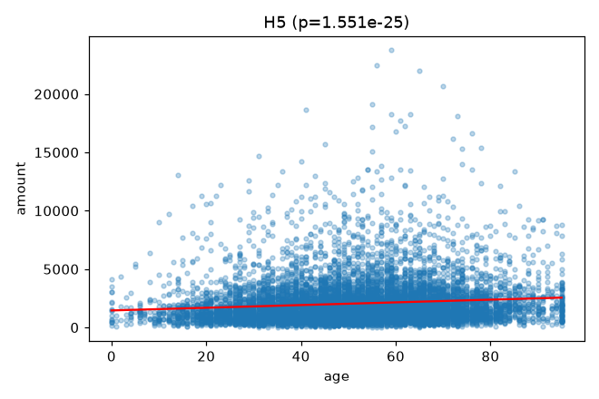
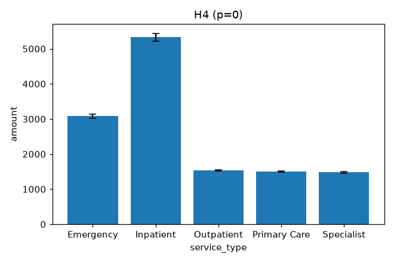

# Self-Correcting Data Analysis Agent

> ⭐ **Flagship / signature portfolio project.** An end-to-end agentic system that writes and executes real SQL, validates its own results against statistical and clinical checks, and self-corrects on failure — with a published Tableau dashboard and a verified literature review.

## Overview

An agentic system that autonomously generates exploratory analyses from healthcare claims data using Claude with tool use. The agent inspects a dataset's schema, proposes ranked clinical hypotheses, writes and executes SQL queries in a sandboxed environment, validates results against statistical and clinical sanity checks, and self-corrects on failure — up to 3 retries per hypothesis — before producing a structured Markdown + JSON report.

## Clinical Question

Can an AI agent autonomously generate valid exploratory analyses from healthcare claims data without human intervention, while correctly detecting and recovering from data quality errors (negative costs, missing diagnosis codes, invalid ages)?

## How the Agent Works

1. **Schema inspection** — loads the dataset, hashes PII columns (`member_id`, `provider_id`) immediately, profiles null rates, cardinality, and numeric ranges.
2. **Hypothesis generation** — Claude proposes up to 5 ranked clinical hypotheses from the schema profile.
3. **Query execution** — Claude writes parameterized, **raw row-level** SQL (no `GROUP BY`, aggregate functions, or window functions — statistics are computed by the validation layer, not SQL); a sandbox layer blocks destructive operations, caps row count, and enforces a 30-second timeout.
4. **Result validation** — checks null rates, impossible clinical values (negative cost, invalid age), outlier rates, and runs the appropriate statistical test (t-test, ANOVA, chi-square, regression, or descriptive).
5. **Self-correction** — on failure, Claude receives the specific failure reason and rewrites the query. Max 3 retries per hypothesis.
6. **Multiple-comparisons correction** — after all hypotheses are evaluated, p-values across the run are adjusted with Benjamini-Hochberg (FDR) correction, since testing several hypotheses against one dataset at an uncorrected α=0.05 inflates the run-level false-positive rate.
7. **Report generation** — writes a Markdown report (with an embedded chart per successful hypothesis) and JSON run metadata with full error/retry lineage.

## Architecture

See `docs/workflow_diagram.mermaid` for the full flowchart and `docs/agent_design.md` for the complete design specification.

## How to Run

```bash
# 1. Install dependencies
pip install -r requirements.txt

# 2. Set your API key
cp .env.example .env
# edit .env and add your ANTHROPIC_API_KEY

# 3. Generate the synthetic dataset (already included, regenerate if needed)
python data/generate_synthetic_data.py

# 4. Run the agent
python src/agent.py --dataset data/claims_sample.csv

# 5. Run the deterministic test suite (no API key required)
python tests/test_agent.py
```

## Sample Output

The deterministic tool layer (schema inspection, query execution, validation, report writing) has been run-verified against the included 10,000-record synthetic dataset:

```
PASS: schema_inspect — 10000 rows, 0 unreliable columns
PASS: execute_query — 10 rows in 0.14ms
PASS: safety blocklist — caught prohibited_keyword:DROP
PASS: validator caught negative_cost — negative_cost
PASS: validator accepted clean query — test=regression, p=0.0335
PASS: t-test Inpatient vs Primary Care — p=0.000000, significant=True, direction=Inpatient
PASS: generate_chart — wrote outputs/test_figures/H_CHART_TEST_chart.png (14855 bytes)
PASS: apply_multiple_comparison_correction — BH adjusted p-values match hand-computed example
PASS: save_report — wrote outputs/analysis_smoketest/analysis_report.md

9/9 tests passed.
```

Full end-to-end output (hypothesis generation through final report) requires a live `ANTHROPIC_API_KEY` and is produced in `outputs/analysis_<run_id>/` after running `src/agent.py`.

## Key Findings

> **Correction (2026-08-18):** the first version of this section reported a "5-run Claude Sonnet 5 characterization," but every one of those 5 runs actually executed on `claude-sonnet-4-6` — a stale `AGENT_MODEL=claude-sonnet-4-6` entry in the local `.env` file overrode `config.py`'s new default (env vars take precedence over code defaults), and the recorded `model_version` field wasn't checked before reporting results. The `.env` override has been fixed, and the characterization below was re-run for real on Sonnet 5. The mislabeled run is kept below, correctly relabeled, since it's still a valid (if differently-attributed) result: it's what proved the prompt fix alone — no model upgrade required — eliminates the window-function abort bug.

### Prompt-fix validation — 5-run characterization (Claude Sonnet 4.6)

The agent was run 5 times end-to-end against the same 10,000-record dataset on `claude-sonnet-4-6` with the corrected planner/corrector prompts (no model upgrade yet). Every run is reported below — none cherry-picked or discarded:

| Run | Passed | Aborted | Self-correction triggers | Window-function errors |
|---|---|---|---|---|
| `1a561eec` | 5 / 5 | 0 | 3 | 0 |
| `af1481bd` | 5 / 5 | 0 | 3 | 0 |
| `d944159b` | 5 / 5 | 0 | 3 | 0 |
| `36ea8b07` | 5 / 5 | 0 | 3 | 0 |
| `dbdbd8d7` | 5 / 5 | 0 | 3 | 0 |
| **Total** | **25 / 25 (100%)** | **0** | **15** | **0** |

All 15 correction triggers were `negative_cost`, every one resolved on the first retry.

### Model-upgrade validation — 5-run characterization (Claude Sonnet 5, genuine)

With `.env` fixed, the agent was run 5 more times, this time verified via each run's recorded `model_version: "claude-sonnet-5"`:

| Run | Passed | Aborted | Self-correction triggers | Window-function errors |
|---|---|---|---|---|
| `c93d384f` | 5 / 5 | 0 | 2 | 0 |
| `7b7d8423` | 5 / 5 | 0 | 2 | 0 |
| `bd48c2a9` | 5 / 5 | 0 | 4 | 0 |
| `04cbf330` | 5 / 5 | 0 | 2 | 0 |
| `c063b712` | 5 / 5 | 0 | 2 | 0 |
| **Total** | **25 / 25 (100%)** | **0** | **12** | **0** |

Again all triggers were `negative_cost`, again every one resolved on the first retry — a slightly lower trigger count than the Sonnet 4.6 sample (12 vs. 15 across 25 hypotheses), consistent with but not strong evidence of a modest quality improvement; 25 hypotheses per model is too small a sample to claim more than that.

### What changed, and why

A prior single run (`ec1d5144`, kept below for the historical record) completed only 3/5 hypotheses: two were aborted after the model repeatedly emitted a SQLite-invalid `AVG(x) OVER (...)` window function it couldn't self-correct within the 3-retry budget. Root cause: the **first-attempt** query-planner prompt never told the model to avoid aggregates/window functions — only the *retry* prompt did, and even that phrasing didn't rule out an aggregate function used as a window function.

Two changes, validated separately above:
1. **Prompt fix** — both the planner and corrector system prompts now explicitly forbid `GROUP BY`, aggregate functions, and window functions (naming the exact `AVG(x) OVER (...)` anti-pattern), since the validator computes all statistics from raw rows itself. **This alone was sufficient** — it fixed the bug on Sonnet 4.6, no model upgrade required.
2. **Model upgrade** — `claude-sonnet-4-6` → `claude-sonnet-5` with adaptive thinking enabled (`thinking={"type": "adaptive"}`, `effort: "high"`), which required also fixing response parsing: Sonnet 5 can prepend a `thinking` content block before the text block, so `response.content[0].text` silently breaks (`AttributeError` on a `ThinkingBlock`) — fixed by extracting the first `type == "text"` block instead of assuming position 0.

Across both 5-run samples (10 runs, 50 hypotheses total), the window-function failure mode did not recur even once.

### Statistical rigor: multiple-comparisons correction

Testing 5 hypotheses per run at an uncorrected α=0.05 each inflates the run-level false-positive rate (5 independent tests at α=0.05 give a ~23% chance of at least one false positive even if every null hypothesis is true). Every run now applies **Benjamini-Hochberg (FDR) correction** across its p-values. Real example from Sonnet 5 run `c93d384f`:

| Hypothesis | Test | Raw p | FDR-adjusted p | Significant (raw → adjusted) |
|---|---|---|---|---|
| H1 | chi-square | 0.2558 | 0.4263 | No → No |
| H2 | ANOVA | ≈0 | ≈0 | **Yes → Yes** |
| H3 | t-test | 0.5429 | 0.6787 | No → No |
| H4 | chi-square | 0.7817 | 0.7817 | No → No |
| H5 | regression | 1.55e-25 | 3.88e-25 | **Yes → Yes** |

The two genuine findings (service type is strongly associated with cost; age is a weak but real positive predictor of cost) survive correction; the three null results stay null — exactly the behavior a multiple-comparisons correction is supposed to produce.

### Generated charts

Each successful hypothesis now renders a PNG chart (bar-with-error-bars for t-test/ANOVA, grouped bar for chi-square, scatter-with-fit for regression, histogram for descriptive), embedded directly in the Markdown report. Two real examples (from the Sonnet 4.6 sample, run `1a561eec`):

 

### Historical record — before the Tier 1/2 fixes

Kept for transparency, not deleted: the diagnostic run that motivated the fixes above, and the very first run that predates it. Both ran on Claude Sonnet 4.6 (the model in use at the time).

**`ec1d5144` (pre-fix):** 3/5 passed, 2 aborted. Self-correction triggered on all 5 hypotheses (13 attempts): `missing_column` ×4, `negative_cost` ×4, `misuse of window function AVG()` ×4, `aggregated_data_detected` ×1. The 3 passing queries were manually inspected and confirmed correct.

**`07d0f881` (earliest run):** 5/5 passed, self-correction resolved 4/5.

The honest takeaway across all reported runs: the deterministic validator and bounded-retry fail-safe behaved correctly throughout — recovering when a fix was reachable, aborting cleanly when it wasn't — and the specific gap that caused `ec1d5144`'s aborts (window-function misuse) is now fixed and empirically absent across 10 runs spanning both models.

## Interactive Dashboard (Tableau Public)

A Tableau Public dashboard visualizes the run metadata directly from the exported CSVs (`tableau/`, produced by `scripts/export_results.py`): (a) hypothesis pass/fail breakdown, (b) self-correction triggers by failure mode, and (c) retries and statistical test per hypothesis.

**Dashboard link:** **[View on Tableau Public →](https://public.tableau.com/views/Self-CorrectingDataAnalysisAgent/Self-CorrectingDataAnalysis)** — build steps in [`docs/tableau_dashboard.md`](docs/tableau_dashboard.md).

> Every figure in the dashboard comes from `outputs/analysis_<run_id>/run_metadata.json`; no values are hand-entered. **Status:** `tableau/*.csv` has been regenerated from genuine Sonnet 5 run `c93d384f` (5/5 passed, including the FDR-adjusted p-values/significance) and is ready to publish — but publishing itself requires the repo owner's Tableau Public account (no API for free-tier publishing), so the link above may still point at the pre-fix `ec1d5144` dashboard until republished. See [`docs/tableau_dashboard.md`](docs/tableau_dashboard.md) → "Updating an already-published dashboard" for the two-step refresh.

## Literature Review

A full review (~1,600 words, **12 sources each individually search-verified** for title/authors/year/venue) situates this project within four research threads — agentic reasoning and tool use, self-correction in LLMs, text-to-SQL, and automated/biomedical hypothesis generation. See [`docs/literature_review.md`](docs/literature_review.md).

Notably, it includes the critical counterpoint — Huang et al. (2024), *"Large Language Models Cannot Self-Correct Reasoning Yet"* — which finds that *intrinsic* self-correction (no external feedback) often fails. This is exactly why this project's correction loop is driven by a **deterministic external validator** (concrete failure codes such as `negative_cost` or `aggregated_data_detected`) rather than by the model's own judgment, and why the self-correction claims are scoped to structural and data-quality errors only.

## Limitations & Future Work

- Operates on SQLite only; PostgreSQL/BigQuery would require an executor refactor
- Self-correction resolves structural and data-quality errors only — it does not detect domain-incorrect hypotheses
- No causal inference; all outputs are descriptive/associative
- Synthetic data results do not generalize to real claims without validation on a credentialed dataset (e.g., MIMIC-IV, CMS public use files)
- The 5-run characterization above varies the *model calls* but reuses the same dataset; `docs/agent_design.md`'s own Evaluation Protocol specifies 5 datasets of varying data-quality profiles (clean, high-missingness, negative-cost-heavy, outlier-heavy, sparse-diagnosis) — that protocol is specified but not yet implemented
- No crash-recovery state serialization between pipeline stages, despite being specified in `docs/agent_design.md` — a run that fails mid-loop currently has to restart from scratch
- Planned: OMOP CDM compatibility layer, longitudinal cohort hypotheses, FastAPI wrapper for team access

## Technologies Used

Python 3.11+ · Anthropic Claude API (`claude-sonnet-5`, adaptive thinking, tool use) · SQLite · pandas · scipy · matplotlib · python-dotenv

## Project History

See [`CHANGELOG_REVIEW.md`](CHANGELOG_REVIEW.md) for the full record of review-driven improvements (literature review, Tableau tooling, the Sonnet 5 upgrade, multiple-comparisons correction, and chart generation) and what's still open.

---

**Author:** Andrew Lee | [GitHub](https://github.com/SaeMind) | [LinkedIn](https://www.linkedin.com/in/agllee/)
